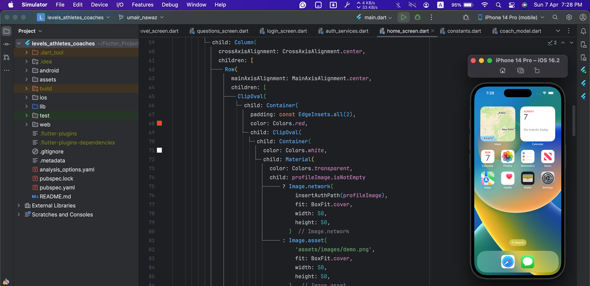

# Levels Up

## Requirements
- Installation of Android Studio and Xcode is required.
- Simulator installation is necessary with Xcode.
- Flutter version `3.13.1` is required.

Note: The app has been exclusively tested on iOS.

## App Run
- Select the desired device (iPhone).
- Run the app; please note that the initial build process may take some time.
  <kbd></kbd>
- You can now proceed to test the app:
  - Sign up as a new user.
  - Log in with your credentials.
  - Upon successful login, the home screen will be displayed.
  - Users can view all available Athletes/Coaches.
  - Users can update their profiles from the profile screen.
  - Logout functionality is available.

## Structure
- lib/constants: Contains all constant strings, such as server URLs.
- assets: Contains all necessary images, including logos and background images.
- services: Directory housing all API services.
- widgets: Contains common widgets used across UI screens.
- screens: Contains UI screens.
- helper: Contains common helper functions.